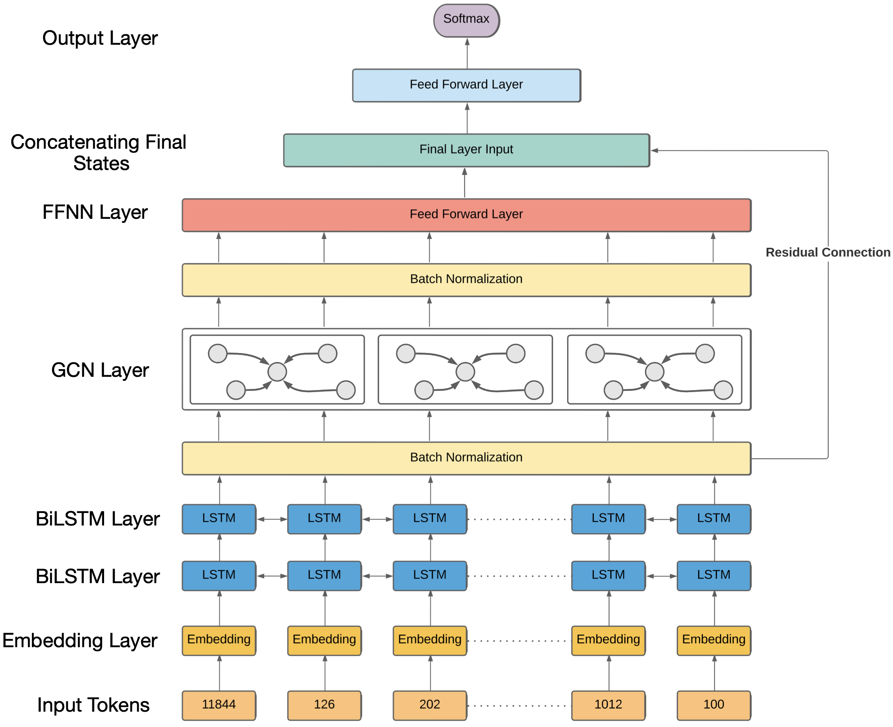

# Syntax-based LSTM (SyLSTM)

Official implementation of the paper titled [Leveraging Dependency Grammar for Fine-Grained Offensive Language Detection using Graph Convolutional Networks](https://aclanthology.org/2022.socialnlp-1.4/). We propose a novel neural network architecture called <i>SyLSTM</i>, which integrates the inherent dependency structure of an input tweet into the deep feature space of the model to overcome biases introduced by overly used pejorative word senses. We test our approach on two open-source datasets for the task of fine-grained offensive language detection, and find that <i>SyLSTM</i> strong baselines such as the state-of-the-art BERT model while utilizing orders of magnitude fewer number of parameters.

<p align="center">

</p>

## <a name="repo-structure"></a>Repo Structure

Structure the repo in the following format after downloading the dataset from source.
```
|-- [root] SyLSTM\
    |-- [DIR] sylstm\
    |-- [DIR] data\
        |-- training_data.csv
    |-- [DIR] logs\
    |-- [DIR] checkpoints\
```

## Dependencies
* python 3.6 or 3.7
* torch>=1.4.0
* transformers==3.0.0
* scikit-learn
* nltk
* spacy
* pyenchant
* compound-word-splitter

## From Docker (Recommended)
Using a docker image requires an NVIDIA GPU.  If you do not have a GPU please follow the directions for [installing from source](#source).
In order to get GPU support you will have to use the [nvidia-docker2](https://docs.nvidia.com/datacenter/cloud-native/container-toolkit/install-guide.html) plugin.
The docker image is cached on the GPU with id 0. In case of OOM errors at training, pass two GPUs.
``` bash
# Download data for the chosen task using the respective link.
# Please maintain the directory tree provided above.

# Build the Dockerfile to create a Docker image.
docker build -t dgoel04/sylstm_guest:1.0 .

# This will create a container from the image we just created.
docker run -it --gpus '"device=gpu-ids"' dgoel04/sylstm_guest:1.0
```

## <a name="source"></a> Build from Source

1) Clone this repository.  
   `git clone https://github.com/dv-fenix/SyLSTM.git`  
   `cd SyLSTM`

2) Download the data for the chosen task using the respective links. Please follow the directory tree given in [Repo Structure](#repo-structure) <br>
<b>NOTE:</b> You may have to change the names of the downloaded data files in order to be compliant with the aforementioned directory tree.

3) Create a python virtual environment to run your experiments. <br>
    `python3 -m venv sylstm_venv`<br>
    `source sylstm_venv/bin/activate`

3) Install the requirements given in `requirements.txt`.    
   `pip install --upgrade pip`  
   `pip install -r requirements.txt`
 
4) Change working directory to run the desired experiment.  
   `cd sylstm` 

## Quick Tour
The first step towards training the SyLSTM is pre-processing the Twitter data and extracting the Dependency Parse Trees (DPTs). We make use of the [spaCy toolkit](https://spacy.io/) for extracting the DPT of an input tweet. Please refer to our paper for more information on the pre-processing module developed here.
``` bash
sh preprocess.sh
```

The code to train the SyLSTM is fairly modular. Here we provide a shell script with a sample training configuration for the SyLSTM.
``` bash
# For more information on the optional experimental setups and configurations.
python ./sylstm/train.py --help

# You can manually change the arguments in run_train.sh to choose the different SyLSTM configurations.
sh run_train.sh
```
Please make sure that all the arguments are to your liking before getting started with the training!

## Cite

If you use this code in your study/project, please cite the paper:
```
@inproceedings{goel2022leveraging,
  title={Leveraging Dependency Grammar for Fine-Grained Offensive Language Detection using Graph Convolutional Networks},
  author={Goel, Divyam and Sharma, Raksha},
  booktitle={Proceedings of the Tenth International Workshop on Natural Language Processing for Social Media},
  pages={45--54},
  year={2022}
}
```


